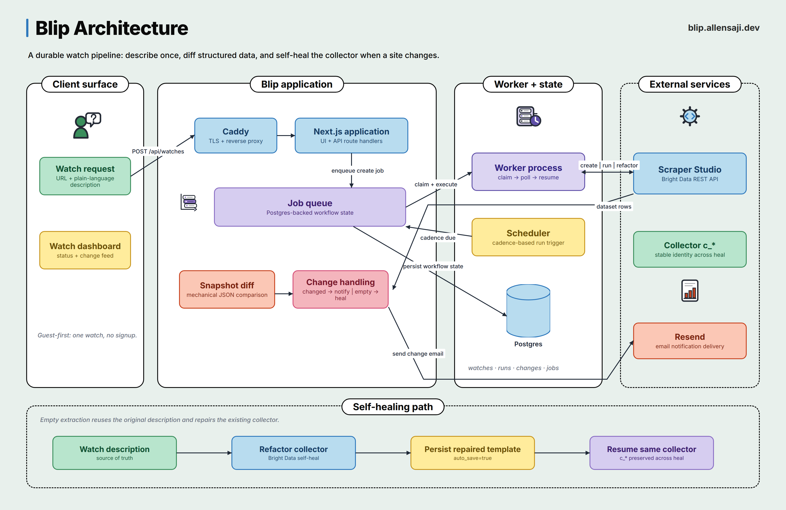

<div align="center">
  
  <h1>Blip</h1>
  <p><strong>You never miss a blip.</strong></p>

  <p>
    <a href="https://blip.allensaji.dev">Live demo</a> ·
    Built with <a href="https://brightdata.com/products/scraper-studio">Bright Data Scraper Studio</a>
  </p>
</div>

Blip is a self-healing change monitor for the web. Paste a URL, describe what matters in plain English, and Blip watches it for you. When the value you care about changes, you get a clean, human-readable diff by email. When the site redesigns itself and the scraper breaks, Blip repairs it automatically.

---

## The problem

Scrapers work in testing, then break quietly the first time a site changes a class name. Generic change-monitoring tools only match keywords, so they cannot watch a specific value on a specific page. Blip is a personal change monitor where the self-healing is the product.

## How it works

1. **Describe once.** Paste a URL and describe the field you care about in plain language ("the price", "whether it is in stock"). No selectors, no code.
2. **Watch.** Scraper Studio extracts that field as structured data. Blip snapshots it on a schedule (hourly, daily, or weekly).
3. **Detect.** When the structured output changes, Blip diffs it and produces a readable "what changed" message.
4. **Self-heal.** When a site redesigns and extraction comes back empty, Blip hands Scraper Studio the original plain-language description. Scraper Studio rewrites the extraction, the collector heals itself, and the data keeps flowing. The user never sees a gap.

The plain-language description is the source of truth: it is used for the initial scrape *and* for repair.

## Features

- **Guest-first:** no signup. Paste a URL, type what to watch, and get one free watch immediately.
- **Clean diffs by email:** when a watched value changes, Blip sends a human-readable diff (before → after) via [Resend](https://resend.com).
- **Self-healing scrapers:** extraction failures automatically trigger a repair loop against the original description, verified live against a controlled redesign fixture.
- **In-app dashboard:** watch status, run history, and a chronological feed of detected changes.
- **Public data only:** URL validation rejects localhost and private-network targets.

## Architecture

Blip is an async job system, not a request/response CRUD app. Scraper Studio operations are slow by design (create: 5-15 min, run: 30-90 s, self-heal: up to 15 min), so every step is a durable job that is tracked, polled, and resumable.



The production topology keeps Caddy and the Next.js app public while Postgres remains loopback-only. The worker owns the slow Bright Data operations, and the original plain-language description is reused to heal the same `c_*` collector when extraction goes empty.

### Stack

| Concern | Choice |
|---|---|
| Frontend + API | Next.js App Router + Tailwind CSS |
| Database | Postgres + Drizzle ORM |
| Scraping | Bright Data Scraper Studio via REST API |
| Jobs | Postgres-backed queue + worker (`FOR UPDATE SKIP LOCKED`, idempotent handlers) |
| Diff | JSON deep-diff + mechanical summary (no LLM dependency) |
| Notify | Resend (email) + in-app changes feed |

### Why a Postgres-backed job queue

The async reality genuinely needs durable jobs, but the job surface is tiny: three job types, each "do a thing, poll, then enqueue the next step." A `jobs` table with `status`, `attempts`, `locked_at`, and `next_run_at`, plus a single worker loop, is ~300 lines with zero new infrastructure. Two primitives make it correct:

1. `SELECT ... FOR UPDATE SKIP LOCKED` to claim jobs, so two worker ticks never claim the same job.
2. **Idempotent handlers.** A crash mid-poll is safe to re-run: every handler checks "is this step already done?" before doing work.

### Self-heal flow

1. A run returns `[]`, or fields that were present before come back `null`. That is the "site moved" signal, not "no change".
2. Blip enqueues a `heal` job carrying the watch's original plain-language description.
3. The handler calls Scraper Studio's `refactor_template` with a prompt built from that description, polls to the `pending_answer` approval gate, and approves via `resume_automation_job` with `auto_save: true`.
4. The same collector ID is preserved, and a `run` job verifies the recovery.

## Repository layout

```
src/
  app/                    Next.js App Router (pages + API routes)
    api/watches           create and list watches
    api/watches/[id]/check   manual "check now"
    api/changes           in-app changes feed
    fixture/              controlled demo site (v1 → v2 → redesign states)
  db/                     Drizzle schema + migrations
  lib/
    brightdata/           typed Scraper Studio REST client (create/run/heal)
    diff/                 JSON deep-diff engine + mechanical summary (+ unit tests)
    jobs/                 Postgres job queue, worker loop, scheduler
    email.ts              Resend integration
    validation.ts         Zod schemas + URL validation (public-only)
scripts/
  brightdata-contract.ts  live API contract test (create → run → heal → run)
  generate-icons.py       favicon / OG image generator
deploy/
  compose.yml             Postgres + app container config
  blip-web.service        systemd unit for the Next.js app
  blip-worker.service     systemd unit for the job worker
  Caddyfile               TLS + reverse proxy config
worker.ts                 job worker + scheduler entrypoint
```

## Getting started

```bash
npm install
cp .env.example .env      # fill in DATABASE_URL and BRIGHTDATA_API_TOKEN
npx drizzle-kit push      # create tables (or generate + apply migrations)
npm run dev               # frontend + API
npx tsx worker.ts         # job worker + scheduler (separate terminal)
```

### Environment variables

| Variable | Required | Description |
|---|---|---|
| `DATABASE_URL` | yes | Postgres connection string |
| `BRIGHTDATA_API_TOKEN` | yes | Bright Data API token for Scraper Studio REST calls |
| `RESEND_API_KEY` | no | Resend key for email notifications |
| `RESEND_FROM` | no | From address for change emails (defaults to `onboarding@resend.dev`) |

### Tests

```bash
npx tsx src/lib/diff/engine.test.ts      # diff engine unit tests
npx tsx scripts/brightdata-contract.ts   # live Bright Data contract test (uses real credits, run deliberately)
```

## Deployment

A reproducible self-hosted deployment lives in [`deploy/`](deploy/): Docker Compose for Postgres, systemd units for the app and worker, and a Caddyfile for TLS. The production topology keeps the database loopback-only, with Caddy as the only public surface. See [`deploy/README.md`](deploy/README.md) for the full runbook.

## License

[MIT](LICENSE)
